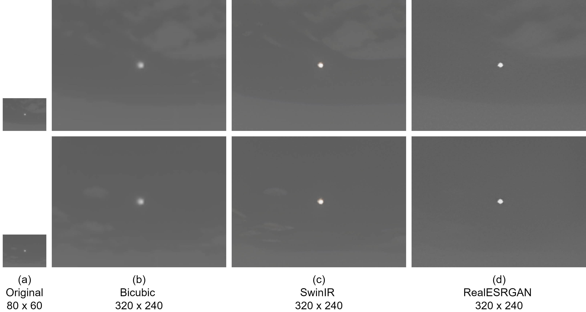

## Traditional-vs-DL-IR-Upscaling-Solar

This is the official repository of the paper  **"Can deep learning outperform traditional methods in upscaling IR images for solar irradiance estimation?"** ([link](https://digital-library.theiet.org/doi/10.1049/icp.2024.3312)).
`train-notebook.ipynb` contains all the necessary codes for data processing and model training.
`datasets/GIRASOL Dataset Extracted` contains train and val folders where each contains one example data with the details of all the data used in each set.    


The dataset was upscaled with the RealESRGAN and SwinIR models using [xinntao/Real-ESRGAN](https://github.com/xinntao/Real-ESRGAN) repository.


# **Can deep learning outperform traditional methods in upscaling IR images for solar irradiance estimation?**
> Md. Yearat Hossain, Ifran Rahman Nijhum, Md. Mahbub Hasan Rakib, and Soumyabrata Dev

## Abstract

Infrared imaging provides crucial information in the infrared spectrum, invisible to standard visible-light imaging systems. However, high-resolution infrared imaging is challenging and expensive, limiting its applications. Deep learning, particularly Convolutional Neural Networks (CNNs), has significantly advanced image processing but relies on high-resolution images for optimal performance. To address the difficulty of acquiring high-resolution infrared images, image upscaling techniques, including traditional interpolation and modern deep learning methods, can be used. This study compares these methods using the GIRASOL dataset for solar irradiance estimation. We evaluated bicubic, bilinear, and nearest neighbor interpolation against deep learning image upscaling models SwinIR and RealESRGAN. Despite their success in upscaling visible spectrum images, these models did not effectively enhance low-resolution infrared images, resulting in less accurate CNN predictions for solar irradiance compared to traditional methods.



## Cite
```
@inproceedings{hossain2024can,
  title={Can deep learning outperform traditional methods in upscaling IR images for solar irradiance estimation?},
  author={Hossain, Md Yearat and Nijhum, Ifran Rahman and Rakib, Md Mahbub Hasan and Dev, Soumyabrata},
  booktitle={IET Conference Proceedings CP887},
  volume={2024},
  number={10},
  pages={250--257},
  year={2024},
  organization={IET}
}
```
